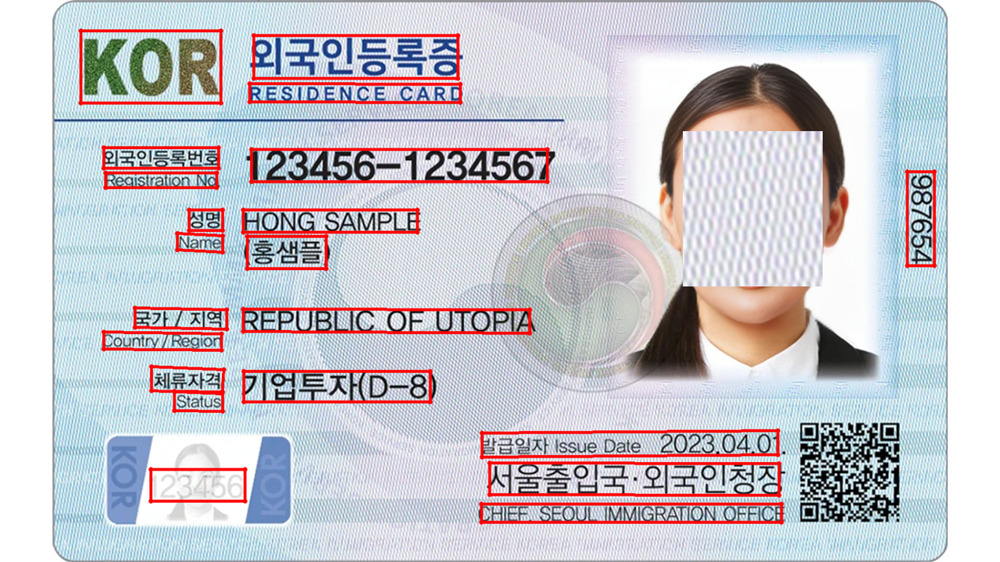

# PaddleOCR C++ Inference

C++ implementation for text detection and recognition using PaddleOCR ONNX models. This project focuses on demonstrating C++ integration with ONNX Runtime for OCR tasks, and the recognition model doesn't work properly, meaning it still needs improvement. This repo supports inference only, see reference for more details.

## Requirements

- OpenCV 4.x
- ONNX Runtime 1.16.3+
- C++14 compiler

## Installation

```bash
# Install OpenCV
sudo apt-get install libopencv-dev

# Install ONNX Runtime
wget https://github.com/microsoft/onnxruntime/releases/download/v1.16.3/onnxruntime-linux-x64-1.16.3.tgz
tar -xzf onnxruntime-linux-x64-1.16.3.tgz
sudo cp -r onnxruntime-linux-x64-1.16.3/include/* /usr/local/include/
sudo cp -r onnxruntime-linux-x64-1.16.3/lib/* /usr/local/lib/
sudo ldconfig
```

## Build & Run

```bash
g++ -std=c++14 -O3 main.cpp nets/nn.cpp -o ocr_inference \
    `pkg-config --cflags --libs opencv4` \
    -I/usr/local/include -L/usr/local/lib -lonnxruntime

./ocr_inference
```

## Result



## Reference

- https://github.com/PaddlePaddle/PaddleOCR
- https://github.com/jahongir7174/PaddleOCR-onnx
- https://github.com/Kazuhito00/PaddleOCR-ONNX-Sample
